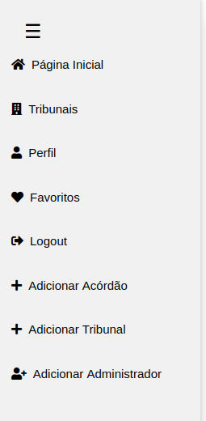
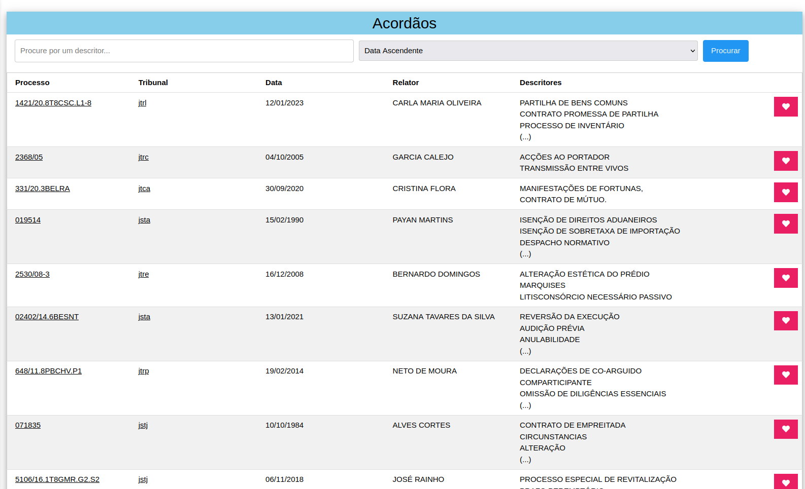

# Relatório de Engenharia web - Base de Dados de Acordãos

## Introdução
A proposta do enunciado escolhida pelo grupo foi a criação de uma aplicação Web de acordão juríridos.

## Utilização

É necessário ir para as pastas Autenticacao, API e FrontEnd e realizar ```npm i```e ```npm start``` para o website correr de forma pretendida.

## Tratamento do datasets

Para o povoamento da base de dados de aplicação, foram fornecidos 14 datasets reais provenientes dos diversos tribunais. Esses datasets continham informações sobre acórdãos, mas com formatos e nomes de campos variados. Foi necessário desenvolver um script <b>treatDataset.py</b> de tratamento para unificar e padronizar esses dados antes de inseri-los na base de dados da aplicação.

## API de dados

A Api de dados implementada posibilita a comunicação  entre o servidor e a interface e a base de dados.

### Base de dados

A base de dados da nossa aplicação foi povoada no mongodb. Ela  possui três coleções: Acordaos, Tribunais e Users

A coleção Acordaos armazenão todos os acórdãos do sistema e é a coleção que está mais envolvida na maioria das funcionalidades.

A coleção Tribunais é simples e apenas armazena as siglas e os respetivos nomes dos tribunais.

A coleção Users é responsavel por armazenar as informações do utilizadores

### Rotas

<b>GET /acordaos</b> : Devolve todos os acórdãos presentes na base de dados, com suporte para paginação.

<b>GET /acordaos/tribunal/:id</b> : Devolve todos os acórdãos de um tribunal específico, identificado pelo id, com suporte para paginação.

<b>GET /acordaos/:id</b> :Devolve um acórdão específico, identificado pelo id.

<b>POST /acordaos</b> : Permite a criação de um novo acórdão na base de dados.

<b>PUT /acordaos/:id</b> : Permite a atualização de um acórdão existente, identificado pelo id.

<b>DELETE /acordaos/:id</b> : Permite a exclusão de um acórdão existente, identificado pelo id.

<b>GET /tribunais</b> : Devolve todos os tribunais presentes na base de dados.

<b>GET /tribunais/:id </b> : Devolve um tribunal específico, identificado pelo id.

<b>POST /tribunais</b> : Permite a criação de um novo tribunal na base de dados.

<b>PUT /tribunais/:id</b> : Permite a atualização de um tribunal existente, identificado pelo id.

<b>DELETE /tribunais/:id</b> : Permite a exclusão de um tribunal existente, identificado pelo id.

<b>GET /users</b> : Devolve todos os utilizadores presentes na base de dados.

<b>GET /users/:id/favorites</b> : Devolve os acórdãos favoritos de um utilizador específico, identificado pelo id.

<b> PUT /users/:id/favorites/:idFav</b> : Adiciona um acórdão aos favoritos de um utilizador específico, identificado pelo id.

<b>DELETE /users/:id/favorites/:idFav</b> : Remove um acórdão dos favoritos de um utilizador específico, identificado pelo id.

<b>GET /users/:id</b> : Devolve um utilizador específico, identificado pelo id.

<b>POST /users</b> : Permite a criação de um novo utilizador na base de dados.

<b>POST /users/register</b> : Regista um novo utilizador e gera um token de autenticação.

<b>POST /users/login</b> : Realiza o login de um utilizador e gera um token de autenticação.

<b>PUT /users/:id</b> : Atualiza as informações de um utilizador específico, identificado pelo id.

<b>PUT /users/:id/desativar</b> : Desativa um utilizador específico, identificado pelo id.

<b>PUT /users/:id/ativar</b> : Ativa um utilizador específico, identificado pelo id.

<b>PUT /users/:id/password</b> : Atualiza a senha de um utilizador específico, identificado pelo id.

<b>DELETE /users/:id</b> : Remove um utilizador específico, identificado pelo id.


## FrontEnd

O FrontEnd tem a responsabilidade estabelecer a comunicação entre o user e o sistema.

### Rotas

<b>GET /</b> : Renderiza a página inicial com a lista de acórdãos, paginada e com botões de ações.


<b>GET /login</b> : Renderiza a página de login.

<b>POST /login</b> : Recebe os dados do formulário de login, faz uma requisição para a API de autenticação, define o cookie de token se a autenticação for bem-sucedida e redireciona para a página inicial.

<b>GET /signup</b> :  Renderiza a página de registro de usuário.

<b>GET /signupADMIN</b> :  Renderiza a página de registro para Admin.

<b>POST /signup</b> : Recebe os dados do formulário de registro, envia para a API de autenticação e redireciona o usuário para a página de login em caso de sucesso, ou renderiza a página de registro com uma mensagem de erro em caso de falha.

<b>POST /signupADMIN</b> : Recebe os dados do formulário de registro, envia para a API de autenticação e redireciona o usuário para a página Inicial em caso de sucesso.

<b>GET /logout</b> : Faz logout no utilizador aberto.

<b>GET /perfil</b> Renderiza a página de perfil do utilizador.

<b>POST /update-password</b> Altera a password.

<b>GET /favoritos</b> Renderiza a página dos acórdãos favoritos.

<b>POST /acordao/favorite/:id</b>: Adiciona um acórdão à lista de favoritos do usuário autenticado.

<b>POST /acordao/unfavorite/:id</b>: Remove um acórdão da lista de favoritos do usuário autenticado.


<b>GET /acordao/tribunal/:id</b>: Renderiza a página inicial com a lista de acórdãos daquele tribunal, paginada e com botões de ações.

<b>GET /acordao/adicionar</b>: Renderiza a página para adicionar o acórdão.

<b>GET /acordao/edit/:id</b>: Renderiza a página para editar o acórdão.

<b>POST /acordao/edit/:id</b>: Atualiza as informações do acórdão.

<b>GET /acordao/delete/:id</b> Remove o aćordão da base de dados.

<b>POST /acordao/adicionar</b> Adiciona um acórdão a base de dados.

<b>GET /acordao/:id</b> Renderiza a página do acórdão.

<b>GET /tribunal/adicionar</b> Renderiza a página para adiconar um tribunal.

<b>POST /tribunal/adicionar</b> Adiciona um tribunal à base de dados.

<b>GET /tribunal</b> Renderiza a página com uma listas dos tribunais.

<b>GET /tribunal/:id</b> Renderiza a página inicial com a lista de acórdãos daquele tribunal, paginada e com botões de ações.


## Autenticação

O servidor Autenticacao é responsavel pela gestão dos utilizadores.

### Rotas

<b>GET /:id</b> Verifica se o usuário autenticado está tentando acessar suas próprias informações.

<b>POST /registerADMIN</b> Regista um novo administrador.

<b>POST /register</b> Regista um novo utilizador.

<b>POST /login</b> Autentica o utilizador.

<b>PUT /:id</b> Atualiza as informações do utilizador.

<b>DELETE /:id</b> Remove utilizador.

<b>PUT /users/:username</b> Atualiza a senha do utilizador.


## Funcionalidades

### Layout

Em todas as pagina é apresentado o Layout, em que dependendo se utlizador esta autenticado ou não, ou se é o admin é diferente.

   


### Registo de Conta

Na página de criação de conta, a aplicação solicita algumas informações para a criação da conta.

Depois de preencher o questionário e confirmar a criação, o sistema verifica se já exite algum utilizador com o mesmo email. Se for confirmado que existe, então a conta não é criada e aplicação informa o utilizador dessa ocorrência. 


### Login da Conta

Na página de Login, a aplicação solicita o username e a password.


### Perfil

Na pagina de perfil o utilizador consegue ver os seus dados e alterar o seu nome.


### Pagina Inicial

Na pagina Inicial temos uma tabela com os acórdãos e um botao para adicionar aos favoritos.



### Favoritos

Na pagina dos favoritos temos uma tabela com os acordãos favoritos do utilizador e apresenta um botão para retirar dos favoritos 


### Tribunais

Na página dos tribunais aparece uma lista dos tribunais.


### Adicionar Acórdão e Editar Acórdão

A pagina de <b>Adicionar acordão</b> é so acessivel para os Admins, tendo que preencher todos os campos necessarios antes de enviar para o sistema ou enviar um ficheiro.


Na pagina de <b>editar o acórdão</b> aparece o mesmo formolario só que ja preenchido em que pode depois alterar o que for necessário.


### Adicionar Tribunal

A pagina de <b>adicionar tribunal</b> é so acessivel para os Admins, tendo apenas que adicionar um nome.


### Criar Administrador

Só o administrador tem a capacidade de criar outros administradores.

Na página de criação da conta de administrador, é apresentado um formulário para preencher.


## Conclusão

Para concluir, dada a realização do trabalho prático, apesar de termos problemas na tratação do dataset e no Docker, podemos dizer que este projeto ajudou a consolidar o conhecimento obtido na cadeira de Engenharia Web.  Através da criação de uma aplicação web para gestão de acórdãos jurídicos, abordamos diversas etapas fundamentais no desenvolvimento de software.
